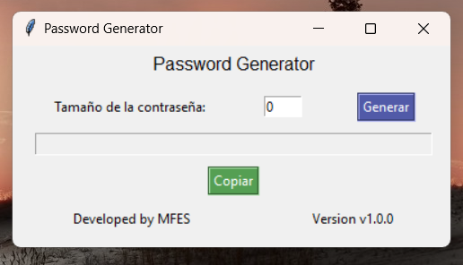

# Password Generator in Python
## Description
This program is designed to generate passwords with random characters.
Passwords can be copied to the clipboard.

## Use
Follow the steps to use the tool:
- Step 1: Open the executable file **PasswordGenerator_ByMFES_v1.0.0.exe**
- Step 2: Enter the character length of the password.
- Step 3: Click the **Generate** button..
- Step 4: Copy the generated password or click the **Copy** button.

## Screenshots


## Password Generator Version
Password Generator `v1.0.0`

## Libraries
You need the **"tkinter"** and **"random"** libraries which are already integrated with python.
And you need the external library **"pyperclip"**.
```python
# Python Modules
import tkinter
import random
# External Modules
import pyperclip
```

### Download Libraries
Pyperclip version: `1.8.2`
```shell
pip install pyperclip
```

## Python Version
Made in `Python v3.11.3`